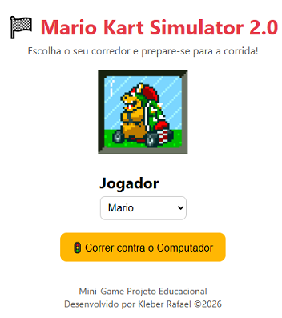

# 🏁 Mario Kart Simulator 2.0

 <table>
    <tr>
        <td>
            
        </td>
    </tr>
</table>

## 🎮 Sobre o Projeto

Mario Kart Simulator 2.0 é um jogo de corrida inspirado no clássico Mario Kart, feito totalmente em **HTML, CSS e JavaScript**.  
Você escolhe um personagem, corre contra o computador, rola dados para avançar e acompanha o placar em tempo real.  
O jogo inclui **efeitos sonoros de vitória, derrota, dados e botões**, além de **música de fundo** que toca baixinha para não atrapalhar a jogabilidade.  

Este projeto é perfeito para estudo de lógica de programação, manipulação de DOM, eventos, animações e integração de áudio em jogos web.  

---

## 🕹️ Como Jogar

1. Abra `index.html` no navegador (recomenda-se usar **Live Server** ou deploy online).  
2. Escolha o seu personagem no menu inicial.  
3. Clique em **“Correr contra o Computador”** para iniciar a corrida.  
4. Clique no botão de **rolar o dado** para avançar seu personagem.  
5. Ao final, veja quem venceu e clique em **“Jogar Novamente”** para reiniciar a partida.  

> ⚠️ Obs: O botão de jogar novamente **toca um som antes de reiniciar a página** e interrompe qualquer som de vitória ou derrota.  

---

## 🎵 Recursos Sonoros

- `start.mp3` – som ao iniciar a corrida  
- `dice.mp3` – som ao rolar os dados  
- `win.mp3` – som de vitória  
- `lose.mp3` – som de derrota  
- `again.mp3` – som do botão **Jogar Novamente**  
- Música de fundo: `onetheme.mp3` (toca baixinha na tela inicial)  

---

## 🖼️ Personagens

O jogo conta com os personagens clássicos do Mario Kart:

- Mario  
- Luigi  
- Peach  
- Yoshi  
- Bowser  
- Toad  
- Donkey Kong  

Todos com gifs animados durante a corrida e na tela inicial.

---

## 🛠️ Tecnologias Usadas

- **HTML5** – estrutura do jogo  
- **CSS3** – layout e animações simples  
- **JavaScript (ES6)** – lógica do jogo, movimentação, eventos e áudio  
- **Vercel (opcional)** – deploy online  

---

## 🔧 Estrutura de Pastas

---

## 🏆 Créditos

Desenvolvido por **Kleber Rafael** como projeto pessoal e portfólio.  
Inspiração: clássicos do **Mario Kart**, mas com lógica de **jogo de dados**.

---

## 📌 Observações

- Para ouvir a música de fundo, é necessário **interagir com a página primeiro** (clique em qualquer botão).  
- O jogo é totalmente **front-end**, não requer servidor backend.  
- Ideal para estudos de **DOM, eventos e manipulação de áudio em JS**.

---

## 🚀 Preview

Divirta-se e tente bater o computador! 🏁
